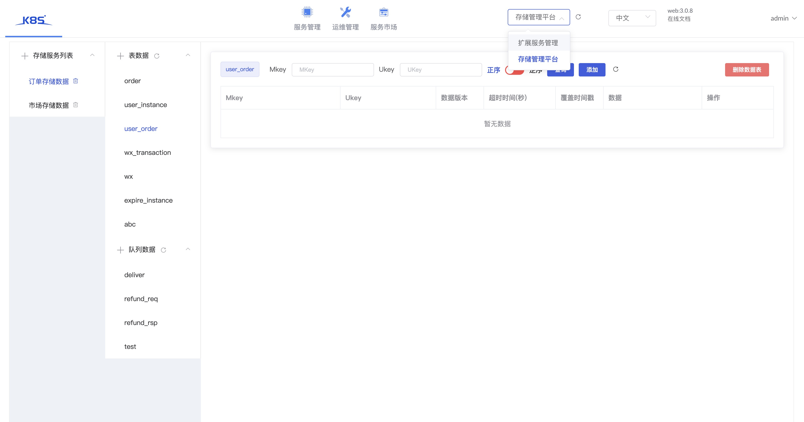
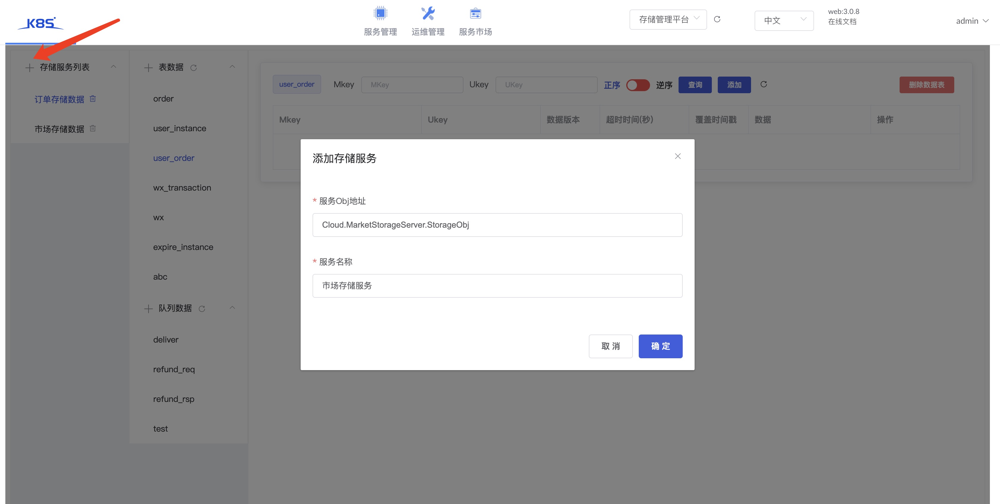

## Service description

- The management service of storageserver can manage data tables and add and delete data
- After installation, it exists as a plug-in and is opened through the plug-in on tarsweb, as shown in the following figure:

## Manage storage data

- As shown in the figure, click the upper left corner to enter the obj of the actual storage service and the associated storage service
- After association, the table and queue of storage service will be displayed
- You can add, delete, modify and check relevant data
- Note: permission management

## Permission description

- The data permission is connected with the permission on tarsweb
- When the user has the development permission of storage service on tarsweb platform, the data is readable
- When the user has the operation and maintenance permission of the storage service on the tarsweb platform, the data is readable/writable